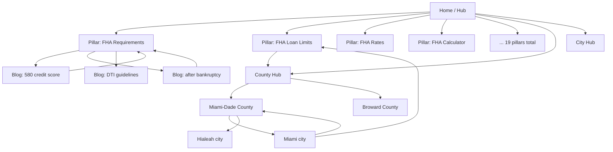

# FHA Mortgages Florida — SEO Architecture & Build Blueprint
**Prepared for:** fhamortgagesflorida.com
**Objective:** Become the most authoritative FHA-loan resource in Florida and rank for the target keyword set — through a quality-first, phased silo build.

> **Read this first — strategic reality check.** This blueprint deliberately departs from a "publish 600 pages now" approach. Google's 2024–2025 spam policies (scaled content abuse, doorway pages) penalize mass near-duplicate pages, and that is the single biggest risk to this project. Domain authority — not page count — is why Rocket, Bankrate, and Zillow rank for head terms. Your realistic, winnable path is **local intent + long-tail + genuine E-E-A-T + backlinks + a Google Business Profile**, executed in phases with real, differentiated content. Every recommendation below is built around that.

---

## 1. Sitemap Architecture

```
fhamortgagesflorida.com/
├── / .......................................... Home (hub)
├── PILLAR PAGES (money pages / silo tops) ...... 19 pages
│   ├── /fha-loan-requirements-florida/
│   ├── /fha-loan-limits-florida/
│   ├── /fha-mortgage-rates-florida/
│   ├── /fha-mortgage-calculator-florida/
│   ├── /fha-mortgage-insurance-florida/
│   ├── /fha-closing-costs-florida/
│   ├── /fha-down-payment-assistance-florida/
│   ├── /fha-refinance-florida/  └─ /fha-streamline-refinance-florida/
│   ├── /fha-203k-loan-florida/
│   ├── /fha-condo-loans-florida/
│   ├── /fha-duplex-loans-florida/ /fha-triplex-loans-florida/ /fha-fourplex-loans-florida/
│   ├── /fha-first-time-home-buyer-florida/
│   ├── /fha-vs-conventional-loan/ /fha-vs-va-loan/ /fha-vs-usda-loan/
│   └── /fha-mortgage-lenders-florida/
├── COUNTY PAGES /locations/county/ ............. 67 pages (all FL counties)
├── CITY PAGES   /locations/city/ ............... 42 prioritized (NOT 300 — see §6)
├── BLOG / GUIDES /blog/ ........................ 31 prioritized cluster articles
├── E-E-A-T / TRUST .............................
│   ├── /about-us/ /meet-the-team/ /author/[name]/
│   ├── /licensing/ /nmls-disclosure/ /editorial-policy/ /advertising-disclosure/
│   ├── /reviews/ /recent-closings/
│   └── /privacy-policy/ /terms-of-use/
└── UTILITY: /contact/ /apply/ /sitemap.html /sitemap.xml /robots.txt /404
```

**Two XML sitemaps** segmented by type (pages vs. blog) for cleaner indexing signals, plus one **HTML sitemap** (`/sitemap.html`) for users and crawl depth.

---

## 2. URL Structure (conventions)

| Rule | Decision |
|---|---|
| Case | lowercase only |
| Words | hyphen-separated, no underscores |
| Trailing slash | pick ONE (recommend trailing slash) and 301 the other; keep canonical consistent |
| Depth | max 2 levels deep (`/locations/miami-fha-loans/` or flat `/miami-fha-loans/`) |
| Keywords | primary keyword in slug, no stuffing |
| Dates in URLs | avoid (the reference competitor uses `/blog/04/03/2026/...` — not recommended; it ages content and bloats the path) |
| County slug | `[county]-county-fha-loans` (e.g., `miami-dade-county-fha-loans`) |
| City slug | `[city]-fha-loans` (e.g., `fort-lauderdale-fha-loans`) |
| Comparison | `fha-vs-[x]-loan` |

> One technical note for your current static build: pages currently ship as `*.html`. Decide **before launch** whether you serve clean URLs (`/fha-loan-limits-florida/`) via host rewrites or keep `.html`, then make canonicals, internal links, and the sitemap all match exactly. Inconsistency here causes duplicate-content and indexing problems.

---

## 3 & 4. Content Silo + Internal Linking Map

**Siloing rule:** link *within* a topic cluster, and link clusters to the hub — don't cross-link everything to everything. That concentrates relevance ("link equity") on the money pages.



**Linking rules by page type**

| From | Links to |
|---|---|
| Home | All 19 pillars, county hub, city hub, top 6 counties, About/Reviews |
| Pillar page | Its supporting blog articles, 2–3 sibling pillars, relevant county/city pages, a CTA to /apply |
| County page | Its cities, the Limits + Requirements pillars, DPA pillar, county FAQ |
| City page | Its county page, Limits + Rates pillars, 2–3 nearby cities |
| Blog article | Its parent pillar (2–3 contextual links), home, one related article |

Aim for **relevant** links (typically 4–10 contextual in-content links per page) — not a raw 15,000 count. The total will grow naturally as the silo fills out.

### 5. Complete Page List to Build

**A. Pillar pages (19)**

- `/fha-loan-requirements-florida/`
- `/fha-loan-limits-florida/`
- `/fha-mortgage-rates-florida/`
- `/fha-mortgage-calculator-florida/`
- `/fha-mortgage-insurance-florida/`
- `/fha-closing-costs-florida/`
- `/fha-down-payment-assistance-florida/`
- `/fha-refinance-florida/`
- `/fha-streamline-refinance-florida/`
- `/fha-203k-loan-florida/`
- `/fha-condo-loans-florida/`
- `/fha-duplex-loans-florida/`
- `/fha-triplex-loans-florida/`
- `/fha-fourplex-loans-florida/`
- `/fha-first-time-home-buyer-florida/`
- `/fha-vs-conventional-loan/`
- `/fha-vs-va-loan/`
- `/fha-vs-usda-loan/`
- `/fha-mortgage-lenders-florida/`


**B. County pages (67) — all Florida counties**

`alachua-county-fha-loans`, `baker-county-fha-loans`, `bay-county-fha-loans`, `bradford-county-fha-loans`, `brevard-county-fha-loans`, `broward-county-fha-loans`, `calhoun-county-fha-loans`, `charlotte-county-fha-loans`, `citrus-county-fha-loans`, `clay-county-fha-loans`, `collier-county-fha-loans`, `columbia-county-fha-loans`, `desoto-county-fha-loans`, `dixie-county-fha-loans`, `duval-county-fha-loans`, `escambia-county-fha-loans`, `flagler-county-fha-loans`, `franklin-county-fha-loans`, `gadsden-county-fha-loans`, `gilchrist-county-fha-loans`, `glades-county-fha-loans`, `gulf-county-fha-loans`, `hamilton-county-fha-loans`, `hardee-county-fha-loans`, `hendry-county-fha-loans`, `hernando-county-fha-loans`, `highlands-county-fha-loans`, `hillsborough-county-fha-loans`, `holmes-county-fha-loans`, `indian-river-county-fha-loans`, `jackson-county-fha-loans`, `jefferson-county-fha-loans`, `lafayette-county-fha-loans`, `lake-county-fha-loans`, `lee-county-fha-loans`, `leon-county-fha-loans`, `levy-county-fha-loans`, `liberty-county-fha-loans`, `madison-county-fha-loans`, `manatee-county-fha-loans`, `marion-county-fha-loans`, `martin-county-fha-loans`, `miami-dade-county-fha-loans`, `monroe-county-fha-loans`, `nassau-county-fha-loans`, `okaloosa-county-fha-loans`, `okeechobee-county-fha-loans`, `orange-county-fha-loans`, `osceola-county-fha-loans`, `palm-beach-county-fha-loans`, `pasco-county-fha-loans`, `pinellas-county-fha-loans`, `polk-county-fha-loans`, `putnam-county-fha-loans`, `santa-rosa-county-fha-loans`, `sarasota-county-fha-loans`, `seminole-county-fha-loans`, `st-johns-county-fha-loans`, `st-lucie-county-fha-loans`, `sumter-county-fha-loans`, `suwannee-county-fha-loans`, `taylor-county-fha-loans`, `union-county-fha-loans`, `volusia-county-fha-loans`, `wakulla-county-fha-loans`, `walton-county-fha-loans`, `washington-county-fha-loans`


**C. City pages — prioritized (42, not 300)**

*Tier 1 (build first — highest population/search):*

`miami-fha-loans`, `jacksonville-fha-loans`, `tampa-fha-loans`, `orlando-fha-loans`, `st-petersburg-fha-loans`, `hialeah-fha-loans`, `fort-lauderdale-fha-loans`, `port-st-lucie-fha-loans`, `cape-coral-fha-loans`, `tallahassee-fha-loans`, `pembroke-pines-fha-loans`, `hollywood-fha-loans`


*Tier 2 (next):*

`gainesville-fha-loans`, `miramar-fha-loans`, `coral-springs-fha-loans`, `lehigh-acres-fha-loans`, `palm-bay-fha-loans`, `west-palm-beach-fha-loans`, `clearwater-fha-loans`, `brandon-fha-loans`, `spring-hill-fha-loans`, `lakeland-fha-loans`, `pompano-beach-fha-loans`, `davie-fha-loans`, `riverview-fha-loans`, `sunrise-fha-loans`, `boca-raton-fha-loans`, `deltona-fha-loans`, `plantation-fha-loans`, `fort-myers-fha-loans`, `palm-coast-fha-loans`, `largo-fha-loans`, `naples-fha-loans`, `sarasota-fha-loans`, `kissimmee-fha-loans`, `melbourne-fha-loans`, `homestead-fha-loans`, `deerfield-beach-fha-loans`, `boynton-beach-fha-loans`, `doral-fha-loans`, `wesley-chapel-fha-loans`, `bradenton-fha-loans`


**D. Blog / guide cluster — prioritized (31)**


*Credit & Qualifying:*

- `/blog/fha-loan-580-credit-score/`
- `/blog/fha-loan-600-credit-score/`
- `/blog/fha-loan-620-credit-score/`
- `/blog/fha-loan-after-bankruptcy/`
- `/blog/fha-loan-after-foreclosure/`
- `/blog/fha-loan-after-short-sale/`
- `/blog/fha-collections-guidelines/`
- `/blog/fha-debt-to-income-ratio/`
- `/blog/fha-student-loans-guidelines/`
- `/blog/fha-self-employed-borrowers/`

*Down Payment & Costs:*

- `/blog/fha-gift-funds-rules/`
- `/blog/fha-seller-concessions/`
- `/blog/fha-closing-costs-who-pays/`
- `/blog/florida-down-payment-assistance-programs/`
- `/blog/florida-hometown-heroes-program/`
- `/blog/fha-no-money-down-options/`

*Comparisons:*

- `/blog/fha-vs-conventional/`
- `/blog/fha-vs-va/`
- `/blog/fha-vs-usda/`
- `/blog/fha-vs-jumbo/`
- `/blog/fha-vs-first-time-buyer-programs/`

*Process & How-To:*

- `/blog/how-to-get-preapproved-fha-florida/`
- `/blog/fha-appraisal-requirements/`
- `/blog/fha-inspection-checklist/`
- `/blog/fha-loan-process-timeline/`
- `/blog/documents-needed-for-fha-loan/`
- `/blog/fha-loan-denied-what-next/`

*Refinance:*

- `/blog/fha-streamline-refinance-explained/`
- `/blog/fha-cash-out-refinance/`
- `/blog/when-to-refinance-fha-to-conventional/`
- `/blog/remove-fha-mortgage-insurance/`


**E. E-E-A-T / trust & utility pages**

- `/about-us/`
- `/meet-the-team/`
- `/author/[loan-officer]/`
- `/licensing/`
- `/nmls-disclosure/`
- `/editorial-policy/`
- `/advertising-disclosure/`
- `/reviews/`
- `/recent-closings/`
- `/privacy-policy/`
- `/terms-of-use/`
- `/contact/`
- `/apply/`
- `/sitemap.html/`


**Total foundational build:** 19 pillars + 67 counties + 42 cities + 31 articles + ~14 trust/utility ≈ **173 high-quality pages** (vs. the brief's 600+). Expand cities/articles later only where keyword research shows real demand.

---

## 6. Priority Order — Phased Roadmap

**Phase 0 — Foundation (you mostly have this).** Home, core pillars, 5 city pages, legal pages, schema, sitemap, green design. ✅ Done.

**Phase 1 — Authority + Trust (weeks 1–4).** This is the highest-ROI work and gates everything else:
- Real **About Us**, **Meet the Team / Author** page with named licensed loan officer + **NMLS#**, photo, bio, credentials.
- **Licensing**, **NMLS disclosure**, **editorial policy**, **advertising disclosure** pages.
- Claim/optimize **Google Business Profile** (huge for "FHA lender near me").
- Collect **real reviews** (then add Review schema — never before).
- Finish the remaining **pillar pages** (19 total): calculator, MIP, closing costs, DPA, refinance, streamline, 203k, condo, multi-unit, first-time buyer, the three comparisons.

**Phase 2 — County silo (weeks 4–10).** Build all 67 county pages — but with *genuinely* differentiated data per county (real limit, real median price, local DPA programs, local market notes). Use a strong template, unique data + 150+ words of unique local prose each. This is your biggest defensible moat vs. national sites.

**Phase 3 — City silo, tiered (weeks 8–16).** Tier 1 cities first, then Tier 2, only as you can keep each genuinely useful. Stop expanding when content quality would drop.

**Phase 4 — Blog clusters (ongoing).** 2–4 quality articles/month, each 1,500–2,500 words, mapped to a pillar. Consistency > burst.

**Phase 5 — Links & PR (ongoing).** Local backlinks (FL real-estate agents, builders, chambers, news), HARO, partnerships. This is what actually closes the gap with big competitors.

---

## 7. Recommended Schema by Page Type

| Page type | Schema |
|---|---|
| Home | Organization, MortgageBroker/FinancialService, WebSite, LocalBusiness |
| Pillar (service) | Service / MortgageLoan, FAQPage, BreadcrumbList |
| County / City | LocalBusiness (areaServed), FAQPage, BreadcrumbList |
| Blog article | Article (or BlogPosting), Author (Person), BreadcrumbList; HowTo for process posts |
| Calculator | WebApplication + FAQPage |
| About / Team | Organization, Person (with NMLS as identifier) |
| Reviews | Review + AggregateRating — **only with genuine, verifiable reviews** |

Keep one self-referencing canonical and one H1 per page; never duplicate schema across templates incorrectly.

---

## 8. Recommended Word Counts

| Page type | Target words | Note |
|---|---|---|
| Home | 1,800–2,800 | Hub + strong internal links; you're ~4,000 on the one-pager already. Don't pad to 5,000 — UX matters. |
| Pillar page | 1,800–3,000 | Match/slightly exceed the best-ranking competitor for that term, not an arbitrary 5,000 |
| County page | 800–1,500 | Unique local data is worth more than raw length |
| City page | 600–1,200 | Genuinely local; avoid templated filler |
| Blog article | 1,200–2,200 | Answer the query fully, then stop |
| Comparison | 1,500–2,500 | Tables + clear verdicts win featured snippets |

> Word count is an *output* of covering a topic well, not a target to hit. Google rewards completeness and helpfulness, not length.

---

## 9. SEO Strategy to Compete With Major FHA Sites

You will not out-authority Rocket/Bankrate/Zillow on head terms soon. You beat them where they're weak:

1. **Local specificity.** They publish generic national content. Your county/city pages with *real* Florida limits, median prices, and named local DPA programs (Hometown Heroes, county SHIP programs) can outrank them for "[city] FHA loan" intent.
2. **E-E-A-T they can't fake locally.** A real, named, licensed Florida loan officer with NMLS#, real reviews, a Google Business Profile, and a physical/service-area presence signals first-hand experience — the "E" the big aggregators lack at the local level. This is your #1 lever.
3. **Long-tail + question intent.** Target the specific queries (e.g., "FHA loan after Chapter 13 in Florida," "FHA condo approval Miami") with dedicated, complete answers + FAQ schema to win People-Also-Ask and AI Overviews.
4. **Freshness on volatile pages.** Update Limits annually (case-number date), refresh the Rates page's "as of" language; competitors often go stale.
5. **Backlinks.** The real authority gap. Earn local links: partner with FL realtors/builders, sponsor local events, get listed in local directories, pitch local press, answer journalist queries.
6. **Technical excellence.** You already have clean, fast, schema-rich static pages — keep Core Web Vitals green; it's a tiebreaker against bloated competitor pages.
7. **Avoid self-sabotage.** No scaled/thin pages, no fake reviews, no doorway county pages. One penalty erases years of work.

Realistic timeline: local/long-tail wins in **3–6 months**; competitive county/city terms **6–12 months**; head terms are a **multi-year** play contingent on links + authority.

---

## 10. Conversion Optimization Recommendations

- **Sticky header CTA** ("Get Pre-Approved") + **click-to-call** in the top bar (you have both).
- **Floating mobile phone/quote button** (thumb-reachable) — add on mobile breakpoints.
- **Lead form above the fold** on every page (you have this) with minimal fields; progressive profiling for the rest.
- **County/city-specific forms** — pre-fill the county field so the lead is pre-segmented (you already pass Source Page; extend to pre-select county).
- **Lead magnets:** "Florida First-Time Buyer Guide (PDF)," "FHA vs Conventional cheat sheet" — gated by email to build a list.
- **Interactive tools as lead capture:** the payment calculator (have it), plus an **affordability calculator** and a short **"Do I qualify for FHA?" quiz** ending in a contact step. Tools earn links and dwell time too.
- **Trust near every CTA:** NMLS#, Equal Housing logo, review snippet, "no credit impact to quote."
- **Speed = conversions:** keep the static, fast build; every second of load costs leads.
- **Track everything:** GA4 + call tracking + form-source tags so you know which pages/counties produce leads, then double down.

---

## What I recommend we build next
Given quality-first sequencing, the highest-ROI next batch is **Phase 1**: the remaining pillar pages (calculator, MIP, closing costs, DPA, refinance, streamline, 203k, condo, multi-unit, first-time buyer, 3 comparisons) + the About/Team/licensing trust pages + an HTML sitemap — all in your current green design, interlinked per §3. I can generate these in batches. Tell me to start, and which batch first.
